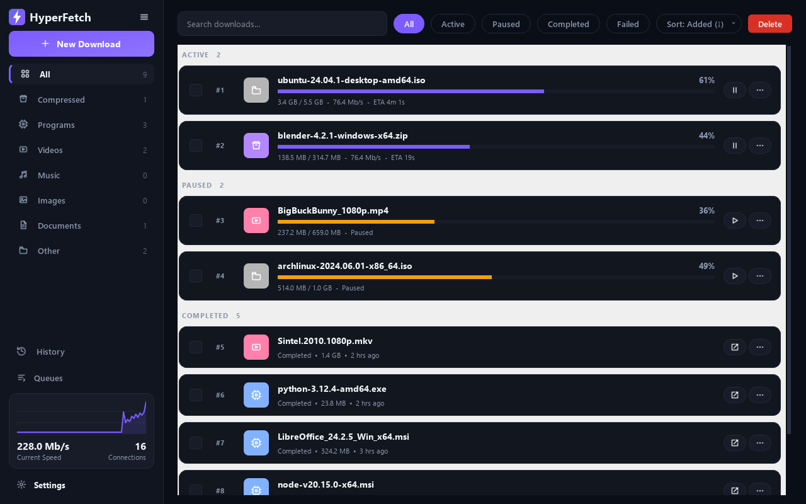

# HyperFetch

A fast, multi-connection download manager for Windows. It splits each file
across many connections, grabs streaming video and torrents, and pairs with a
browser extension that sends your downloads straight to the app.



## Features

- **Download large files much faster** — splits each file across up to 16 connections at once (auto-detects support; falls back to a single stream otherwise).
- **Never lose progress** — pause and resume anytime, even across restarts; resume picks up from the bytes already on disk. Organize downloads into named queues with their own limits.
- **Save streaming video** — capture HLS (`.m3u8`) streams as one playable file, and download from YouTube, Vimeo, Twitch and more with a quality picker.
- **Torrents & magnets** — built in, no separate app needed.
- **Grab downloads from your browser** — right-click a link, click the badge on a video, or auto-capture downloads by file type. The Chrome/Edge extension hands them to the app.
- **Track everything** — every completed download is logged with lifetime totals and stats.
- **Privacy & control** — set speed limits and a global proxy, encrypt DNS lookups (DNS-over-HTTPS), enable UPnP, and optionally verify file integrity with SHA-256.

## Install

**Windows (most people — no Python needed):** download **`HyperFetch-Setup.exe`**
from the [Releases](https://github.com/tanumay-deb/HyperFetch/releases) page and
run it. The installer bundles its own Python runtime and `aria2c`, so it works on
a clean machine. (Unsigned, so Windows SmartScreen shows *"Windows protected your
PC"* on first run → **More info → Run anyway**.) Prefer no install? Grab the
`-portable.zip`, extract it, and run `HyperFetch.exe` inside the folder.

**Developers / other OS (needs Python 3.10+):**

```powershell
pipx install git+https://github.com/tanumay-deb/HyperFetch.git
hyperfetch
```

(No `pipx`? `pip install git+https://github.com/tanumay-deb/HyperFetch.git`, then run `hyperfetch`.)

The window opens and a local server starts at `http://127.0.0.1:5000`.

### From source

```powershell
pip install -r requirements.txt
python main.py          # or double-click HyperFetch.bat
python api_server.py    # headless: queue downloads with no window
```

## Browser extension

1. **Install it** from the
   [Chrome Web Store](https://chromewebstore.google.com/detail/hyperfetch/finojjembpabfbincabngboedegokdlm)
   (works in Chrome, Edge and Brave).
2. In the app, open **Settings → Browser Integration**, copy the pairing token, and paste it into the extension popup.
3. Keep the app running. Right-click a link → **Download with HyperFetch**, or turn on capture to route browser downloads automatically (pick which file types in Settings).

<details><summary>Run the unpacked extension from source (development)</summary>

1. Open `chrome://extensions` (or `edge://extensions`) and enable **Developer mode**.
2. **Load unpacked** → select the `chrome_ext/` folder.

</details>

## How it works

| Part | Role |
|------|------|
| `downloader.py` | segmented HTTP downloader (ranges, retry/backoff, merge) |
| `torrent.py` / `hls.py` / `yt_dl.py` | torrent, HLS, and media-page engines |
| `queue_manager.py` | priority queue, concurrency, scheduler |
| `history.py` | completed-download log + stats |
| `api_server.py` | local Flask server the extension talks to |
| `gui2/` | the desktop GUI |
| `chrome_ext/` · `edge_ext/` | the browser extension (kept in sync) |

The GUI and the server share **one** queue, so browser-sent and manually-added
downloads land in the same list. Everything runs on your machine — no accounts,
no tracking. Settings and state live in `%APPDATA%\HyperFetch\`.

## Tests

```powershell
pip install -r requirements-dev.txt
pytest                                  # Python suite (fully offline)
cd chrome_ext/test && npm install && npm test   # extension tests
```

## Build (Windows)

```powershell
.\build.ps1             # -> dist\HyperFetch\ (portable app)
.\build.ps1 -Installer  # also builds the setup.exe (needs Inno Setup 6)
```

## License

MIT — see [LICENSE](LICENSE). Privacy policy: [PRIVACY.md](PRIVACY.md). Please
download only content you have the right to.
