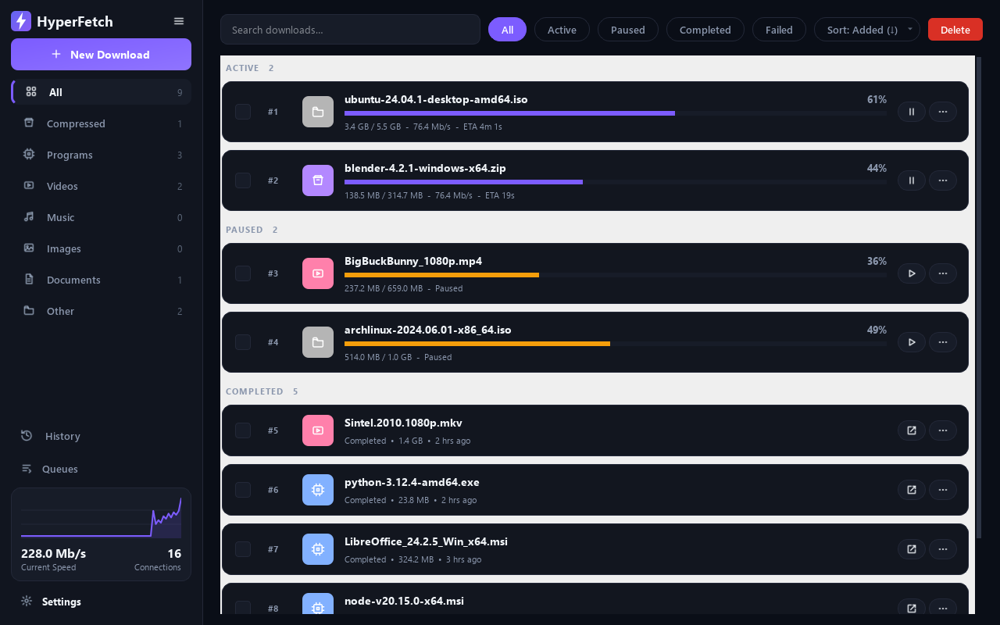

# HyperFetch

A fast, multi-connection download manager for Windows. It splits each file
across many connections, grabs streaming video and torrents, and pairs with a
browser extension that sends your downloads straight to the app.



## Features

- **Download large files much faster** — splits each file across up to 16 connections at once (auto-detects support; falls back to a single stream otherwise).
- **Never lose progress** — pause and resume anytime, even across restarts; resume picks up from the bytes already on disk. Organize downloads into named queues with their own limits.
- **Save streaming video** — capture HLS (`.m3u8`) streams as one playable file, and download from YouTube, Vimeo, Twitch and more with a quality picker.
- **Torrents & magnets** — built in, no separate app needed.
- **Grab downloads from your browser** — right-click a link, click the badge on a video, or auto-capture downloads by file type. The Chrome/Edge extension hands them to the app.
- **Track everything** — every completed download is logged with lifetime totals and stats.
- **Privacy & control** — set speed limits and a global proxy, encrypt DNS lookups (DNS-over-HTTPS), enable UPnP, and optionally verify file integrity with SHA-256.

## Install

**Windows (most people — no Python needed):** download **`HyperFetch-Setup.exe`**
from the [Releases](https://github.com/tanumay-deb/HyperFetch/releases) page and
run it. The installer bundles its own Python runtime and `aria2c`, so it works on
a clean machine. (Unsigned, so Windows SmartScreen shows *"Windows protected your
PC"* on first run → **More info → Run anyway**.) Prefer no install? Grab the
`-portable.zip`, extract it, and run `HyperFetch.exe` inside the folder.

**Developers / other OS (needs Python 3.10+):**

```powershell
pipx install git+https://github.com/tanumay-deb/HyperFetch.git
hyperfetch
```

(No `pipx`? `pip install git+https://github.com/tanumay-deb/HyperFetch.git`, then run `hyperfetch`.)

The window opens and a local server starts at `http://127.0.0.1:5000`.

### From source

```powershell
pip install -r requirements.txt
python main.py          # or double-click HyperFetch.bat
python api_server.py    # headless: queue downloads with no window
```

## Browser extension

1. **Install it** from the
   [Chrome Web Store](https://chromewebstore.google.com/detail/hyperfetch/finojjembpabfbincabngboedegokdlm)
   (works in Chrome, Edge and Brave).
2. In the app, open **Settings → Browser Integration**, copy the pairing token, and paste it into the extension popup.
3. Keep the app running. Right-click a link → **Download with HyperFetch**, or turn on capture to route browser downloads automatically (pick which file types in Settings).

<details><summary>Run the unpacked extension from source (development)</summary>

1. Open `chrome://extensions` (or `edge://extensions`) and enable **Developer mode**.
2. **Load unpacked** → select the `chrome_ext/` folder.

</details>

## Users site

An optional second web app on port 5001, for people who are not at this
machine — the case it was built for is an iPhone, which has no torrent client:
paste a magnet on the phone, this machine fetches it, then save the finished
file to the phone.

It is off until you turn it on, and it is a different door from everything
else. The control page on 5000 answers your LAN and drives every download; this
one answers only its own accounts and only their own downloads. They share the
queue and nothing else — separate ports, separate credential stores, separate
cookie-signing keys.

### Turning it on

The users site ships in **HyperFetch Server**, not in the desktop app. A
download manager is not a hosting service, and keeping them apart is how you
avoid publishing a machine you did not mean to.

```
HyperFetchServer site on
HyperFetchServer users add alice        # prompts for the password
HyperFetchServer invite --new --days 7  # a code to hand out
HyperFetchServer                        # run it
```

`HyperFetchServer users` lists the accounts with what each is using.
`users passwd`, `users disable`, `users enable` and `users remove` do what they
say — `remove` deletes the login and leaves the files.

On the machine itself the site is at `http://127.0.0.1:5001/`.

### Reaching it from outside

The site is bound to `127.0.0.1` and never opens a port on your router. To
reach it from anywhere, put a tunnel in front of it:

```
tailscale funnel 5001
```

That gives an HTTPS address like `https://<machine>.<tailnet>.ts.net`, which
also works behind carrier-grade NAT where port forwarding cannot. Settings
shows the address once the funnel is up.

HyperFetch never starts the tunnel for you. Publishing this machine to the
internet should be a command you type on purpose.

### What an account can and cannot do

An account holder can queue downloads, watch them, and take the finished files.
They see only their own, in their own folder under your download directory.
They cannot reach the control page, the browser-extension routes, or anybody
else's downloads.

Worth deciding deliberately rather than discovering: **every account queues
torrents over your connection, from your IP address.** Quotas cap disk, not
exposure.

### Limits

| | Default | Changed in |
|---|---|---|
| Disk per account | 2 GB | Settings, per account |
| Active downloads per account | 3 | `site_limits.MAX_ACTIVE_PER_USER` |
| Kept for | 30 days after finishing | `site_limits.RETENTION_DAYS` |
| Refuse everything below | 20 GB free | `site_limits.MIN_FREE` |

Retention only ever removes downloads owned by a site account. Yours are never
touched. The free-space floor applies to everybody, including you, because a
full disk breaks the desktop app too.

`site_audit.jsonl` in the app-data folder records sign-ins, additions,
deletions and every file handed over. Note that behind a tunnel every visitor
arrives as `127.0.0.1` — the tunnel runs here — so the account name is the only
identifier in it that means anything.

## How it works

| Part | Role |
|------|------|
| `downloader.py` | segmented HTTP downloader (ranges, retry/backoff, merge) |
| `torrent.py` / `hls.py` / `yt_dl.py` | torrent, HLS, and media-page engines |
| `queue_manager.py` | priority queue, concurrency, scheduler |
| `history.py` | completed-download log + stats |
| `api_server.py` | local Flask server the extension talks to |
| `gui2/` | the desktop GUI |
| `chrome_ext/` · `edge_ext/` | the browser extension (kept in sync) |

The GUI and the server share **one** queue, so browser-sent and manually-added
downloads land in the same list. Everything runs on your machine — no accounts,
no tracking. Settings and state live in `%APPDATA%\HyperFetch\`.

## Tests

```powershell
pip install -r requirements-dev.txt
pytest                                  # Python suite (fully offline)
cd chrome_ext/test && npm install && npm test   # extension tests
```

## Build (Windows)

```powershell
.\build.ps1             # -> dist\HyperFetch\ (portable app)
.\build.ps1 -Installer  # also builds the setup.exe (needs Inno Setup 6)
```

## License

MIT — see [LICENSE](LICENSE). Privacy policy: [PRIVACY.md](PRIVACY.md). Please
download only content you have the right to.
